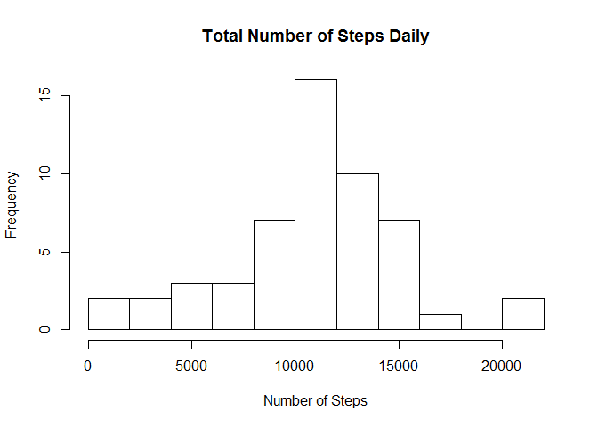
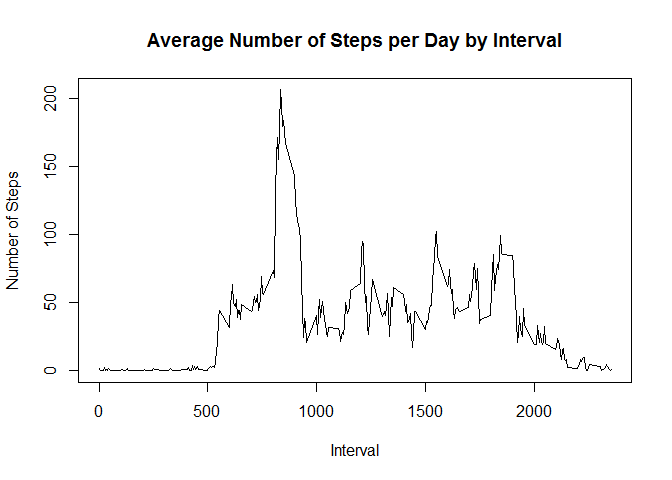
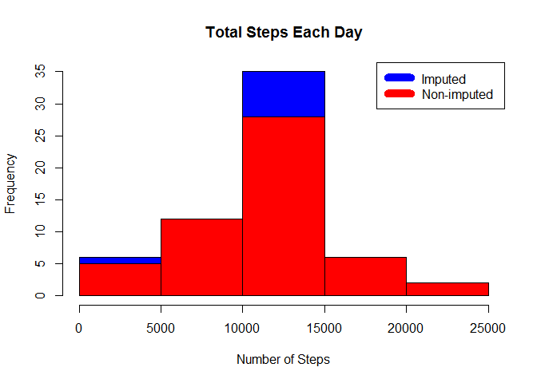
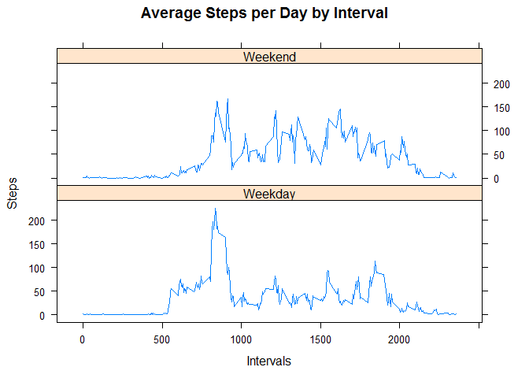

```r
      library(plyr)
      library(lattice)
      options(scipen=100)     
      filename<-"C:\\Users\\zhalabi\\Documents\\RWork\\RepData_Assignment1\\activity.csv"
      Activity<-read.csv(filename)
      Activity$date <- as.Date(Activity$date)
```


```r
      dtActivity<-subset(Activity[,1:2], is.na(Activity$steps)==F)
      dtResultbyDay<-aggregate(dtActivity[,1] , by=list(StepDate=dtActivity[,2]),sum)
      colnames(dtResultbyDay)<-c("Date", "Total") 
      plot.new()
      hist(dtResultbyDay$Total, main="Total Number of Steps Daily", breaks=10, xlab="Number of Steps")
```

 

```r
      meanDay<-mean(dtResultbyDay$Total)
      medianDay<-median(dtResultbyDay$Total)
```

  Mean of the total number of steps taken per day: 10766.1887 
  
  Median of the total number of steps taken per day: 10765 


```r
      dtActivity<-subset(Activity[,c("steps","interval")], is.na(Activity$steps)==F)
      dtResultbyInterval<-aggregate(dtActivity[,1] , by=list(dtActivity[,2]),mean) 
      colnames(dtResultbyInterval)<-c("interval", "steps") 
      plot(dtResultbyInterval$interval,dtResultbyInterval$steps, type="l", xlab="Interval", ylab="Number of Steps",main="Average Number of Steps per Day by Interval")
```

 

```r
      max_interval <- dtResultbyInterval[which.max(dtResultbyInterval$steps),1]
```

On average across all the days in the dataset, the 835th contains the maximum number of steps


```r
      dtActivity<-subset(Activity[,c("steps","interval")], is.na(Activity$steps)==F)
      incomplete <- sum(!complete.cases(Activity))
      dtImputed <- transform(Activity, steps = ifelse(is.na(Activity$steps), dtResultbyInterval$steps[match(Activity$interval, dtResultbyInterval$interval)], Activity$steps))
      dtImputed[as.character(dtImputed$date) == "2012-10-01", 1] <- 0
      dtStepsbyDayImputed <- aggregate(steps ~ date, dtImputed, sum)
      hist(dtStepsbyDayImputed$steps, main = paste("Total Steps Each Day"), col="blue", xlab="Number of Steps")
      hist(dtResultbyDay$Total, main = paste("Total Steps Each Day"), col="red", xlab="Number of Steps", add=T)
      legend("topright", c("Imputed", "Non-imputed"), col=c("blue", "red"), lwd=10)
```

 

```r
      meanDayImputed <- mean(dtStepsbyDayImputed$steps)
      medianDayImputed <- median(dtStepsbyDayImputed$steps)
      meanDiff <- meanDay - meanDayImputed
      medianDiff <- medianDay - medianDayImputed
      totalDiff <- sum(dtResultbyDay$Total) - sum(dtStepsbyDayImputed$steps)
```

  The total number of missing values in the dataset: 2304 
  
  The mean of total number of steps taken per day: 10766.1887 
  
  The median of total number of steps taken per day: 10765 
  
  The mean of total number of steps taken per day (Imputing Estimates): 10589.6938 
  
  The median of total number of steps taken per day (Imputing Estimates): 10766.1887 
  
  The mean of the difference between real vs. estimate: 176.4949 
  
  The median of the difference between real vs. estimate: -1.1887 
  
  The total of the difference between real vs. estimate: -75363.3208 

  Based on the summary results and the histogram listed above, the estimated median is very close to the median of the original dataset in which the missing values were ignored. However, the mean value differs slighltly.


```r
      names(dtImputed)<-c("steps","dt","intv")
      weekdays <- c("Monday", "Tuesday", "Wednesday", "Thursday", "Friday")
      dtImputed$dayow = as.factor(ifelse(is.element(weekdays(as.Date(dtImputed$dt)),weekdays), "Weekday", "Weekend"))
      steps_by_interval_i <- ddply(dtImputed,.(intv,dayow),summarise,steps=mean(steps))
      xyplot(steps_by_interval_i$steps ~ steps_by_interval_i$intv|steps_by_interval_i$dayow, main="Average Steps per Day by Interval",xlab="Intervals", ylab="Steps",layout=c(1,2), type="l")
```

 

Generally, activities start and stop earlier during weekdays.

On Weekends, activity is less during the early morning hours but there are more activity during the day on average.  

On weekdays, activity is far less after (8pm) but there is surge of activities after (8pm) on weekends.


